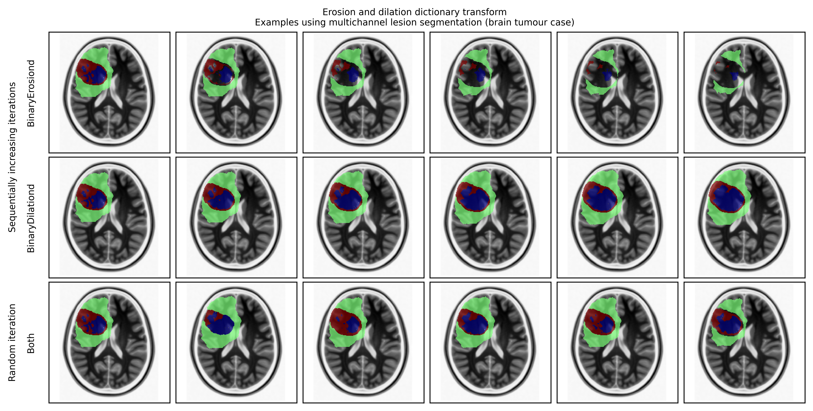

# Multichannel erosion and dilation augmentation of 3D masks

These are [MONAI](https://monai.io)-compatible dictionary-based transforms for multi-channel erosion and dilation of masks, for example in the erosion or dilation of synthetic lesions.

## Dictionary transforms
The transforms are available in [erosion_dilation.py](erosion_dilation.py)

Both BinaryErosiond and BinaryDilationd accept the following arguments:
```
Args:
keys: keys of the corresponding items to be transformed.
See also: :py:class:`monai.transforms.compose.MapTransform`
prob: probability of augmentation application.
(Default 0.1, with 10% probability that Binary Erosion will occur)
iteration: Specify a specific number of iterations to be run.
(Default 1)
random_iteration: Specify to take a random number of iterations between the range iteration_low, iteration_high
(Default True)
iteration_low: lower limit for the random integer selection for number of iterations for Binary Erosion
(Default 1)
iteration_high: upper limit for the random integer selection for number of iterations for Binary Erosion
(Default 5)
fill_holes: whether to fill holes of output mask (especially helpful for boundaries with multilabel masks)
(Default False)
allow_missing_keys: don't raise exception if key is missing.
verbose: enable verbose mode for debugging.
seed: random seed for the generator.
```

## Example use
A Jupyter Notebook with example use case for a multi-channel brain tumour segmentation is available in [example_use.ipynb](example_use.ipynb). A sample image of this is shown below.



The lesion segmentation is from the [GitHub repo here](https://github.com/high-dimensional/tumour-seg and accompanying [article](https://doi.org/10.1093/braincomms/fcad118):
```
Ruffle JK, Mohinta S, Gray R, Hyare H, Nachev P. Brain tumour segmentation with incomplete imaging data. Brain Communications. 2023. DOI 10.1093/braincomms/fcad118
```

## Use queries
Via github issue log or email to j.ruffle@ucl.ac.uk
