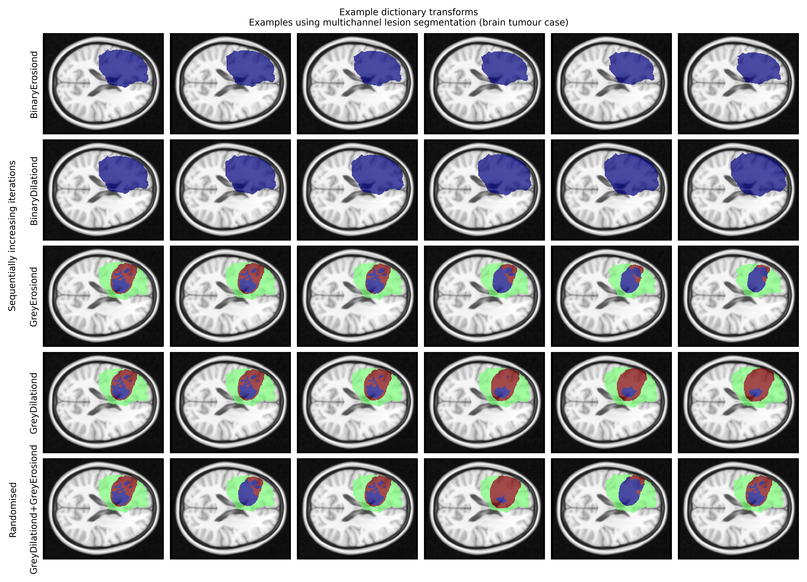

# Multichannel erosion and dilation augmentation of 3D masks

These are [MONAI](https://monai.io)-compatible dictionary-based transforms for erosion and dilation of masks, for example in the erosion or dilation of synthetic lesions. This includes both single (use ```BinaryDilationd``` or ```BinaryErosiond```) and multi-channel lesions (use ```GreyDilationd``` or ```GreyErosiond```).

## Dictionary transforms
The transforms are available in [erosion_dilation.py](erosion_dilation.py)

## Example use
A Jupyter Notebook with example use case for a multi-channel brain tumour segmentation is available in [example_use.ipynb](example_use.ipynb). A sample image of this is shown below.



The lesion segmentation is from the [GitHub repo here](https://github.com/high-dimensional/tumour-seg) and accompanying [article](https://doi.org/10.1093/braincomms/fcad118):
```
Ruffle JK, Mohinta S, Gray R, Hyare H, Nachev P. Brain tumour segmentation with incomplete imaging data. Brain Communications. 2023. DOI 10.1093/braincomms/fcad118
```

## Use queries
Via GitHub issue log or email to j.ruffle@ucl.ac.uk
